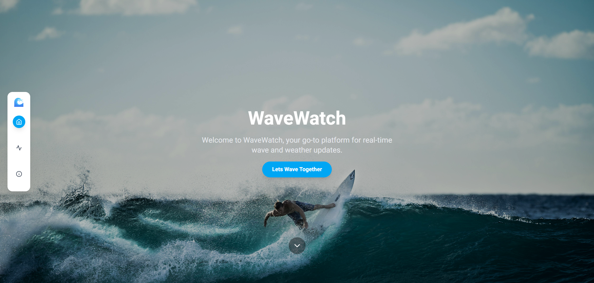

# 🌊 WaveWatch

WaveWatch is a modern and responsive web platform for checking **real-time wave & weather conditions** around the world.  
Built for **surf lovers, sailors, and sea enthusiasts**, WaveWatch delivers accurate and up-to-date data in a clean, minimal, and mobile-friendly interface.



## 🚀 Features
- 🌊 **Live Wave & Weather Data** – Check wave height, wind speed, humidity, and more.
- 📍 **Search Any City** – Get instant data for your desired location.
- 📱 **Responsive Design** – Optimized for both desktop and mobile devices.
- 🎯 **Interactive Side Navigation** – Smooth navigation between sections with active state indicators.
- ⚡ **Fast & Modern UI** – Built with React + TailwindCSS.

## 🛠️ Tech Stack
- **Frontend:** React, TypeScript, TailwindCSS
- **Icons:** React Icons
- **API:** [OpenWeather](https://openweathermap.org/) for live weather data

## 📦 Installation
1. Clone the repository:
   ```bash
   git clone https://github.com/yourusername/wavewatch.git
   ```
2. Navigate to the project folder:
   ```bash
   cd wavewatch
   ```
3. Install dependencies:
   ```bash
   npm install
   ```
4. Run the development server:
   ```bash
   npm run dev
   ```

## 🌍 Live Demo
Check out the live site here: **[WaveWatch Live](https://wavewatch-app.netlify.app/)**

## ❤️ Credits
Built with love for all surf lovers by [**Ben Katalan**](https://benkatalan.netlify.app)  
Weather data provided by [OpenWeather](https://openweathermap.org/)

---
